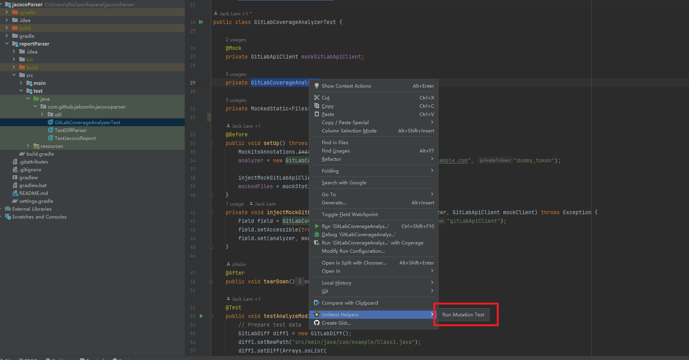
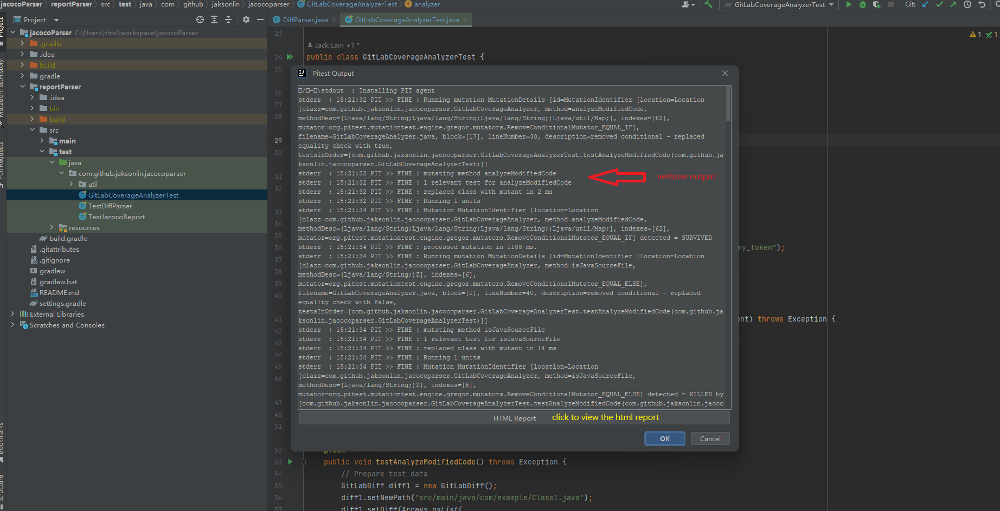
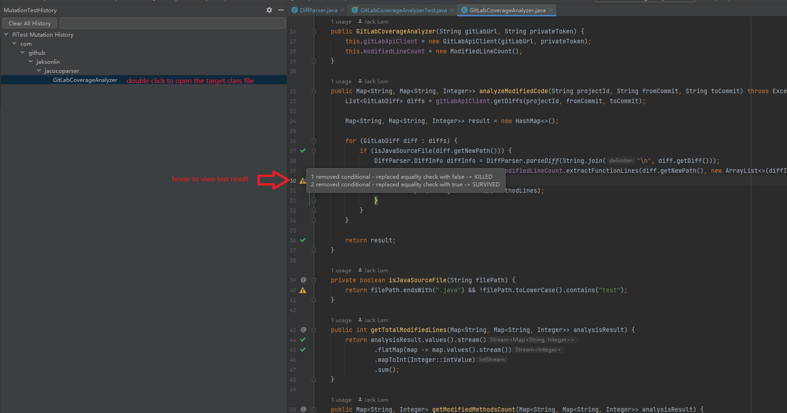

# TestCraft

<!-- Plugin description -->
TestCraft is the evolution of the [pitest-gradle](https://plugins.jetbrains.com/plugin/25546-pitest-gradle) plugin, expanding its capabilities beyond Gradle-based PITest mutation testing. While the original plugin focused on running PITest mutation testing for Java Gradle projects, TestCraft now offers a comprehensive testing suite that includes:

- PITest mutation testing support for both Gradle and Maven projects
- Advanced test case management features
- AI-powered test analysis capabilities

The plugin has been renamed to TestCraft to better represent its expanded functionality and modern testing features. Current version: 1.0.8 (continuing from the last pitest-gradle version).

<!-- Plugin description end -->

## Migration from pitest-gradle

- uninstall pitest-gradle
- install TestCraft plugin

## Features

### Mutation Testing
- Run PITest mutation testing on your Java **Gradle & Maven** projects
- View mutation test results in a dedicated tool window
- Navigate directly to mutated code with inline editor decorations
- Track mutation testing history and trends

### Test Case Management
- Manage test cases with structured annotations
- Validate test assertions to prevent trivial or redundant tests
- Enforce test documentation standards with comment validation
- Track test cases across your codebase

### AI-Powered Testing Assistant
- Get intelligent suggestions for test improvements
- Analyze test coverage and quality
- Copy responses in markdown format for documentation
- Integration with local LLM services (e.g., Ollama) for privacy

## Installation

1. Download the latest release from the [releases page]()
2. Open IntelliJ IDEA
3. Go to `File` -> `Settings` -> `Plugins` -> `Install Plugin from Disk...`
4. Select the downloaded `.zip` file

## Usage

### Mutation Testing
1. Open your JUnit test file and ensure it passes
2. Right-click on the test file and select `Run Mutation Test` in the `TestCraft` menu
3. Input the target class (e.g., `com.example.MyClass` or `MyClass`)
4. View results in the `Mutation Test History` tool window

### Test Case Management
1. Configure test annotations in `Settings` -> `TestCraft` -> `Test Annotations`
2. Set up assertion validation rules in `Settings` -> `TestCraft` -> `Test Case Validation`
3. Add required annotations to your test methods
4. TestCraft will validate your tests as you write them

### AI Testing Assistant
1. Configure LLM settings in `Settings` -> `TestCraft` -> `LLM Settings`
2. Right-click on a test method and select `Analyze Test` for AI suggestions
3. View suggestions in the `LLM Suggestions` tool window
4. Copy suggestions as markdown for documentation

## Screenshots

### Mutation Testing

*Running a mutation test on a target class*

*Detailed mutation test results with browser view option*

*Mutation Test History with searchable interface*

### Test Case Management
[Add screenshots for test case management features]

### AI Testing Assistant
[Add screenshots for AI testing features]

## Configuration

### Test Annotations
Configure test case management annotations in `Settings` -> `TestCraft` -> `Test Annotations`:
- Define required fields
- Set validation rules
- Configure auto-import behavior

### Test Validation
Set up test validation rules in `Settings` -> `TestCraft` -> `Test Case Validation`:
- Define invalid assertion patterns
- Configure comment requirements
- Set validation severity levels

### LLM Settings
Configure AI integration in `Settings` -> `TestCraft` -> `LLM Settings`:
- Set up Ollama endpoint
- Configure model parameters
- Manage response formatting

## Plugin Compatibility

TestCraft is compatible with IntelliJ IDEA versions 2020.1 through latest published (not rc/eap). 

## License

TestCraft is licensed under the Apache License 2.0. See the [LICENSE](LICENSE) file for details.