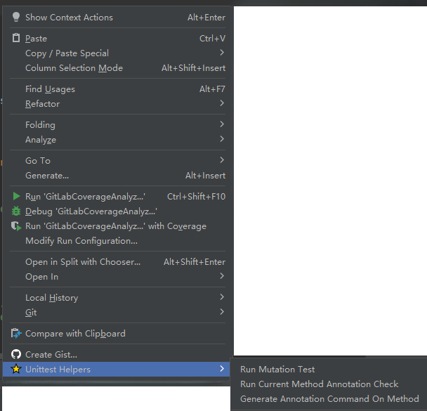

# Test Case Management

TestCraft provides comprehensive test case management features to help you maintain high-quality, well-documented test suites through structured annotations and automated validation.

## Overview

Test case management in TestCraft includes:
- Custom test annotations for documenting test cases
- Automated validation of test assertions
- Test documentation enforcement
- Quick actions for generating and checking annotations

## Test Annotations

### Available Actions

TestCraft adds these actions to your context menu under `Unittest Helpers`:
- `Run Current Method Annotation Check` - Validates annotations for the current test method
- `Generate Annotation Command On Method` - Automatically generates required annotations
- `Run Mutation Test` - Runs mutation testing on the annotated test


*Available test management actions*

### Standard Annotations

TestCraft supports these annotations out of the box:
```java
@TestCase(
    id = "TC001",
    description = "Verify user login with valid credentials",
    steps = {
        "Enter valid username",
        "Enter valid password",
        "Click login button"
    },
    expected = "User should be logged in successfully"
)
```

### Custom Annotations

You can configure custom annotations in:
`Settings` → `TestCraft` → `Test Annotations`


*Custom annotation configuration*

## Test Validation

TestCraft automatically validates your tests for:

### 1. Required Annotations
- Checks for presence of required annotations
- Validates annotation field contents
- Ensures proper documentation

### 2. Assertion Quality
- Detects missing assertions
- Identifies weak assertions
- Validates assertion coverage

### 3. Documentation Standards
- Enforces comment requirements
- Checks documentation completeness
- Validates test naming conventions


*Test validation results in the editor*

## Configuration

### Test Annotation Settings

Configure in `Settings` → `TestCraft` → `Test Annotations`:
- Required annotation fields
- Custom annotation templates
- Auto-import settings
- Documentation requirements

### Test Validation Rules

Configure in `Settings` → `TestCraft` → `Test Case Validation`:
- Invalid assertion patterns
- Required assertion count
- Comment requirements
- Validation severity levels


*Test validation configuration*

## Best Practices

1. **Consistent Naming**
   - Use descriptive test names
   - Follow a consistent naming pattern
   - Include test scenario in the name

2. **Complete Documentation**
   - Document test purpose
   - List test steps clearly
   - Specify expected results
   - Include any prerequisites

3. **Effective Assertions**
   - Use specific assertions
   - Test one concept per method
   - Include positive and negative cases
   - Avoid redundant assertions

4. **Maintainable Structure**
   - Group related tests
   - Use test categories
   - Keep tests independent
   - Follow arrange-act-assert pattern

## IDE Integration

### Code Completion

TestCraft provides smart code completion for:
- Test annotation fields
- Assertion methods
- Test documentation


*Smart code completion for test annotations*

### Quick Fixes

The plugin offers quick fixes for common issues:
- Missing annotations
- Incomplete documentation
- Invalid assertions
- Documentation formatting


*Quick fix suggestions in the editor*

### Navigation

Easy navigation features include:
- Jump to test implementation
- Find related tests
- Navigate between test steps
- Locate test data

## Troubleshooting

Common issues and solutions:

1. **Missing Annotations**
   - Use Generate Annotation action
   - Check annotation imports
   - Verify annotation configuration

2. **Validation Errors**
   - Review validation settings
   - Check assertion requirements
   - Update documentation standards

3. **Configuration Issues**
   - Reset to default settings
   - Verify project configuration
   - Check plugin settings

## Next Steps

- Learn about [Mutation Testing](mutation-testing.md)
- Explore [AI Testing Assistant](ai-testing.md)
- Configure [Custom Test Annotations](../advanced/custom-annotations.md) 